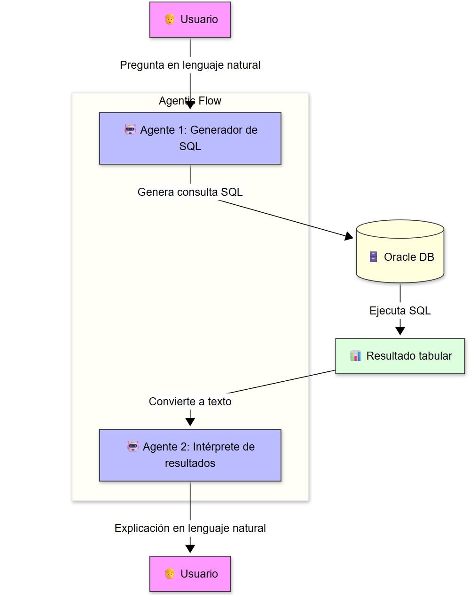
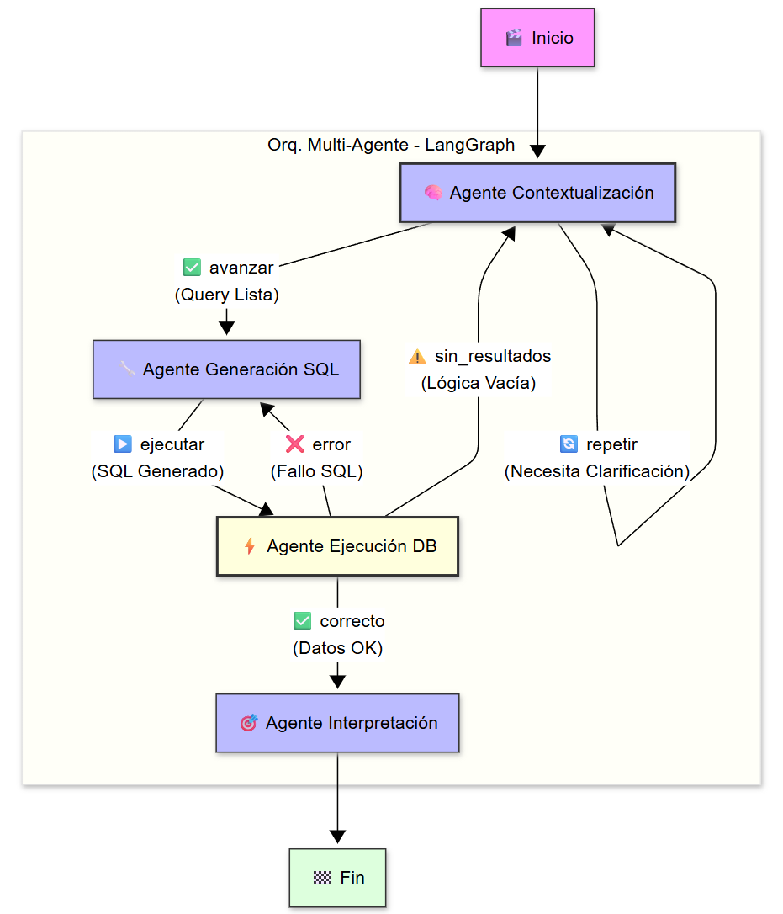

# 🧠 DBV-AgenticEduSQL

Este proyecto es una práctica educativa diseñada para enseñar cómo integrar modelos de lenguaje generativo (LLMs) con bases de datos Oracle. A través de **tres niveles progresivos**, los estudiantes aprenderán desde lo básico hasta arquitecturas profesionales de orquestación multi-agente para generar y ejecutar consultas SQL a partir de lenguaje natural.

## 🎯 Objetivo

El objetivo principal es que los estudiantes de informática aprendan a:
- Conectarse a una base de datos Oracle desde Python.
- Formular preguntas en lenguaje natural sobre los datos.
- Usar un modelo de IA (como Gemini, GPT de OpenAI, etc.) para traducir esas preguntas a código SQL.
- Ejecutar las consultas de forma segura y obtener los resultados.
- Comprender las diferencias entre usar una librería nativa y un framework de abstracción multi-proveedor.



Este diagrama muestra el flujo completo del sistema de agentes que conecta la inteligencia artificial con la Base de Datos Oracle  para procesar consultas en lenguaje natural.

## 🚀 Tres Niveles de Aprendizaje Progresivo

El proyecto se presenta en **tres notebooks** que van desde lo básico hasta arquitecturas profesionales de orquestación multi-agente:

### 📘 Nivel 1: `oracle_agentic_gemini_apikey.ipynb` (Fundamentos - Enfoque Simple)

**Tu primer paso en IA + Bases de Datos**

Esta versión utiliza la librería oficial de Google (`google-generativeai`) con **API Key** para máxima simplicidad.

- **Ventaja Principal**: Ideal para **empezar**. Solo necesitas una API Key. Perfecta para entender el flujo básico: pregunta → SQL → resultado.
- **Arquitectura**: Lineal y directa (2 agentes secuenciales)
- **Ideal para**: Primeros contactos con IA generativa y SQL

---

### 📗 Nivel 2: `oracle_agentic_hello_world.ipynb` (Intermedio - Multi-Proveedor)

**Flexibilidad y comparación de modelos**

Esta versión utiliza **AISuite**, un framework que abstrae múltiples proveedores de IA (OpenAI, Google, Anthropic).

- **Ventaja Principal**: **Flexibilidad total**. Cambia entre `openai:gpt-4o`, `google:gemini-2.0-flash`, `anthropic:claude-3-sonnet` con una línea de código.
- **Arquitectura**: Lineal mejorada con funciones reutilizables
- **Ideal para**: Proyectos que necesitan comparar modelos o mantener independencia del proveedor

---

### 📕 Nivel 3: `orquestador_base_datos.ipynb` (Avanzado - Orquestación Profesional)

**Arquitectura Multi-Agente con LangGraph**

Esta versión implementa **orquestación compleja** usando LangGraph para gestionar múltiples agentes con bucles de retroalimentación.

- **Ventaja Principal**: **Robustez profesional**. Sistema que valida, corrige errores automáticamente y adapta el flujo según el contexto.
- **Arquitectura**: Máquina de Estados Finitos (FSM) con 4 agentes orquestados:
  1. **Agente Contextualización**: Valida la pregunta y el esquema (bucle de clarificación)
  2. **Agente Generación SQL**: Crea el código SQL optimizado
  3. **Agente Ejecución DB**: Ejecuta y valida resultados (bucle de corrección SQL)
  4. **Agente Interpretación**: Convierte resultados a lenguaje natural
- **Tecnologías**: LangGraph (orquestación) + AISuite (flexibilidad de modelos)
- **Ideal para**: Sistemas de producción que requieren validación, corrección automática y manejo de casos complejos



**🔄 Características Clave de la Orquestación:**
- ✅ **Bucle de Clarificación**: Si la pregunta es ambigua, solicita más información
- ✅ **Bucle de Corrección SQL**: Si el SQL falla, lo regenera automáticamente
- ✅ **Bucle de Realimentación**: Si no hay resultados, revisa la pregunta
- ✅ **Estado Compartido (Blackboard)**: Todos los agentes trabajan sobre el mismo contexto
- ✅ **Transiciones Condicionales**: El flujo se adapta según los resultados

## 🤔 ¿Qué Nivel Elegir? Comparación de Arquitecturas

La elección depende de tu nivel de experiencia y los requisitos de tu proyecto. Sigue la ruta de aprendizaje progresivo:

| Característica | 📘 Nivel 1 (Gemini API Key) | 📗 Nivel 2 (AISuite Multi-Proveedor) | 📕 Nivel 3 (LangGraph Orquestación) |
| :--- | :--- | :--- | :--- |
| **Complejidad** | ⭐ Básica | ⭐⭐ Intermedia | ⭐⭐⭐ Avanzada |
| **Arquitectura** | Lineal (2 agentes secuenciales) | Lineal con funciones modulares | Máquina de Estados (4 agentes orquestados) |
| **Proveedor IA** | Solo Google Gemini | Multi-proveedor (OpenAI, Google, Anthropic) | Multi-proveedor + Orquestación |
| **Validación** | Manual | Manual | **Automática** (bucles de corrección) |
| **Manejo de Errores** | Básico | Mejorado con Result Type Pattern | **Avanzado** (reintentos automáticos) |
| **Flexibilidad** | Baja | Alta | **Muy Alta** (flujo adaptativo) |
| **Caso de Uso** | Aprendizaje básico | Comparación de modelos | Sistemas de producción |
| **Tecnologías** | `google-generativeai` | `aisuite` | `langgraph` + `aisuite` |
| **Líneas de Código** | ~200 | ~350 | ~600 (pero más robusto) |

### 🎓 Ruta de Aprendizaje Recomendada

1. **Empieza con Nivel 1** → Entiende el concepto básico de agentes IA
2. **Avanza a Nivel 2** → Aprende flexibilidad y comparación de modelos
3. **Domina el Nivel 3** → Implementa sistemas profesionales con orquestación

### 📚 Recursos Adicionales

- **`buenaspracticas.ipynb`**: Guía completa de buenas prácticas de Python moderno (3.10+)
  - Type hints, funciones limpias, manejo de errores, documentación
  - Ejemplos ❌ MAL / ✅ BIEN
  - Referenciado en todos los notebooks del proyecto


## 🧰 Requisitos

- **Python 3.10+** (requerido para sintaxis moderna de tipos: `str | None`, `TypeAlias`, `Literal`)
  - ⚠️ Los notebooks incluyen validación automática de versión
  - 💡 Se recomienda Python 3.10+ para aprovechar todas las características
- Acceso a una base de datos Oracle
- Claves API del proveedor de IA que desees utilizar (OpenAI, Google, Anthropic, etc.)
- Jupyter Notebook o VS Code con extensión de Jupyter

## 📦 Instalación

1.  Clona el repositorio.
2.  Crea y activa un entorno virtual:
    ```bash
    python -m venv .venv
    # En Windows: .venv\Scripts\activate
    # En macOS/Linux: source .venv/bin/activate
    ```
3.  Instala las dependencias:
    ```bash
    pip install -r requirements.txt
    ```
4.  Crea un archivo `.env` a partir de `.env.sample` y añade tus credenciales de Oracle y las API Keys que vayas a usar (ej. `OPENAI_API_KEY`, `GOOGLE_API_KEY`).

## 🚀 Cómo Usar

1.  Ejecuta el script `basedatos.sql` en tu base de datos Oracle para crear las tablas y los datos de ejemplo.
2.  Abre el cuaderno de Jupyter que prefieras.
3.  Sigue las instrucciones del cuaderno para conectar a Oracle, formular una pregunta, generar el SQL y ver el resultado.

## 🔐 Seguridad

Este proyecto usa `.env` para proteger credenciales. No compartas tu archivo `.env` ni subas claves API a repositorios públicos.

## 👨‍🏫 Autor

David Bueno Vallejo — Profesor universitario de informática, apasionado por la enseñanza práctica, la IA agentic y la innovación educativa.

## ✨ Agradecimientos Especiales

Un agradecimiento especial a las IAs que colaboraron en la creación y mejora de este proyecto: **Gemini de Google** y **Copilot de GitHub**. Su asistencia fue fundamental para la depuración de código, la generación de explicaciones y la elaboración de esta documentación.

## 📄 Licencia

Este proyecto está bajo licencia MIT. Puedes usarlo, modificarlo y compartirlo libremente con fines educativos o personales.

---

¡Esperamos que disfrutes esta práctica y que te inspire a seguir explorando el mundo de la IA agentic aplicada a bases de datos!